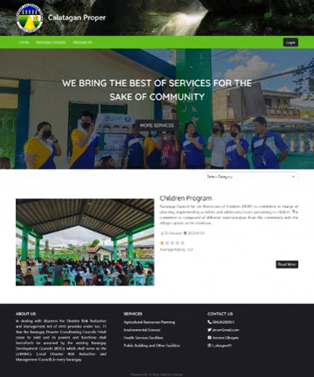

# Barangay Website Builder For LGU Quality E-Services

## Description
 This is a **Capstone Thesis Project** which is the main objective is to design and  develop a website builder for barangay
 that help the barangay officials create,manage, and modify content on a website
 without the need for specialized technical knowledge to provide reliable information for the residents. 
 It used MVC Design Pattern for developing the web application.
 

## Demo 

## Features of System

### &nbsp;&nbsp; Admin  

 * Create Pages
 * Change Password
 * Update Profile
 * Create Users & Assign Roles
 * Manage Category Content

      * Add Category
      * Update Category
      * Delete Category

 * Publish Content

      * Delete Content 
      * Update Content 
      * Confirm Post 

* Create Content 
    * Construct Draft

 * Edit Website Design
 * Administrator Logs
 

 ### &nbsp;&nbsp; Secretary

* Create Content
* Construct Draft
* View Content
* Update Profile
* Change Password

### &nbsp;&nbsp; Treasurer

* Create Content
* Construct Draft
* View Content
* Update Profile
* Change Password

## Technology Used

* HTML
* CSS
* JS
    * JQUERY
    * AJAX 
* BOOTSTRAP 5
* JAVA
    * Jsp
    * Servlet

## Databases
* MYSQL

## Future Scope

- Add Image Carousel in Main Front Page  
- Additional User Management Features  

